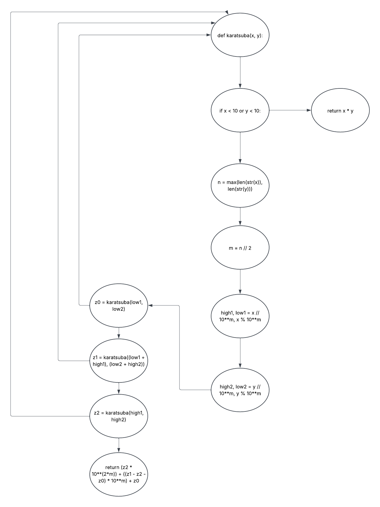

# Karatsuba #
## Execução ##
Para executar o codigo execute o cmd no local do arquivo main.py 
insira o comando :
`python  main.py`
no seu cmd 

## Explicação linha a linha ##

1. `def karatsuba(x, y):`
   - Define a função `karatsuba` que recebe dois números inteiros, `x` e `y`, como entrada.

2. `if x < 10 or y < 10:`
   - Verifica se `x` ou `y` são números pequenos (menores que 10). Se sim, o algoritmo não precisa ser aplicado.

3. `return x * y`
   - Retorna o produto direto de `x` e `y` usando multiplicação tradicional, pois é mais eficiente para números pequenos.

4. `n = max(len(str(x)), len(str(y)))`
   - Calcula o número máximo de dígitos entre `x` e `y`. Isso é necessário para determinar o ponto de divisão dos números.

5. `m = n // 2`
   - Calcula o ponto médio `m`, que é a metade do número de dígitos. Isso divide os números em duas partes.

6. `high1, low1 = x // 10**m, x % 10**m`
   - Divide o número `x` em duas partes:
     - `high1`: a parte alta (dígitos mais significativos).
     - `low1`: a parte baixa (dígitos menos significativos).

7. `high2, low2 = y // 10**m, y % 10**m`
   - Divide o número `y` em duas partes:
     - `high2`: a parte alta (dígitos mais significativos).
     - `low2`: a parte baixa (dígitos menos significativos).

8. `z0 = karatsuba(low1, low2)`
   - Calcula o produto das partes baixas (`low1` e `low2`) recursivamente usando o algoritmo de Karatsuba.

9. `z1 = karatsuba((low1 + high1), (low2 + high2))`
   - Calcula o produto da soma das partes baixas e altas (`low1 + high1` e `low2 + high2`) recursivamente.

10. `z2 = karatsuba(high1, high2)`
    - Calcula o produto das partes altas (`high1` e `high2`) recursivamente.

11. `return (z2 * 10**(2*m)) + ((z1 - z2 - z0) * 10**m) + z0`
    - Combina os resultados usando a fórmula de Karatsuba:
      - `z2 * 10**(2*m)`: desloca o produto das partes altas para a esquerda.
      - `(z1 - z2 - z0) * 10**m`: ajusta e desloca o termo intermediário.
      - `z0`: adiciona o produto das partes baixas.
    - Retorna o resultado final da multiplicação.

12. `if __name__ == "__main__":`
    - Verifica se o script está sendo executado diretamente 

13. `num1 = 12345678901234567890`
    - Define o primeiro número grande para teste.

14. `num2 = 98765432109876543210`
    - Define o segundo número grande para teste.

15. `result = karatsuba(num1, num2)`
    - Chama a função `karatsuba` para multiplicar os dois números.

16. `print(f"O resultado da multiplicaçãp de {num1} por {num2} é: {result}")`
    - Exibe o resultado da multiplicação no console.

## Análise ciclomática ##
M = E - A + 2(P)  
E ( número de arestas ) = 10   
A ( número de nós ) = 11  
P ( chamda de outras funçoes ) = 1  

M = 10 - 11 + 2*1  
M = -1 + 2  
M = 1  

## Grafo algoritimo Karatsuba ##

